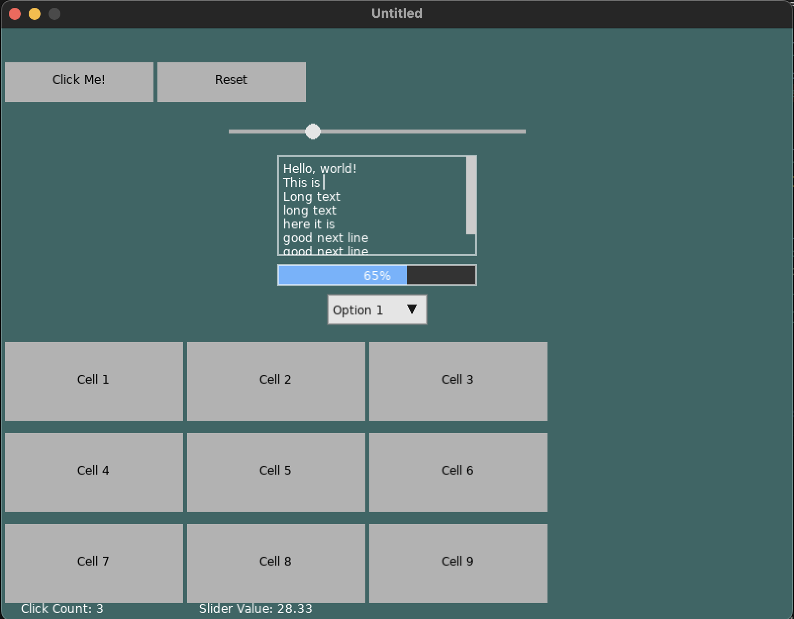

# TinyLoveGUI

TinyLoveGUI is a lightweight and easy-to-use GUI framework for the LÖVE 2D game engine. It provides a set of customizable UI components to help you quickly build user interfaces for your LÖVE projects.



## Features

- Flexible layout system with `RowLayout` and `ColumnLayout`
- Various UI components:
  - Button
  - Slider
  - Popup
  - TextArea (with multi-line support)
  - ProgressBar
  - OptionSelect (dropdown)
- Hierarchical view system
- Easy-to-use API
- Customizable styles and colors

## Installation


Just  drop `tinylovegui.lua` to your project. `require("tinylovegui")`in your reference source file


## Usage

Here's a quick example of how to create a simple GUI using TinyLoveGUI:

```lua
local TinyLoveGUI = require("tinylovegui")

local mainView, button, slider

function love.load()
    mainView = TinyLoveGUI.View(0, 0, 800, 600)
    
    button = TinyLoveGUI.Button(50, 50, 100, 40, "Click me!")
    button.onClick = function()
        print("Button clicked!")
    end
    
    slider = TinyLoveGUI.Slider(50, 100, 200, 20, 0, 100, 50)
    slider.onChange = function(value)
        print("Slider value:", value)
    end
    
    mainView:addChild(button)
    mainView:addChild(slider)
end

function love.update(dt)
    mainView:update(dt)
end

function love.draw()
    mainView:draw()
end

function love.mousepressed(x, y, button)
    mainView:mousepressed(x, y, button)
end

function love.mousereleased(x, y, button)
    mainView:mousereleased(x, y, button)
end

function love.mousemoved(x, y, dx, dy)
    mainView:mousemoved(x, y, dx, dy)
end
```

## Demo

A comprehensive demo is included to showcase the capabilities of TinyLoveGUI. The demo includes:

- Multiple buttons with click counters
- A slider with real-time value display
- A multi-line text area
- A progress bar
- A dropdown (OptionSelect) component
- A grid layout demonstrating nested layouts
- Popups for user feedback

To run the demo:

1. Ensure you have LÖVE installed on your system.
2. Place the `TinyLoveGUI.lua` file in your project directory.
3. Copy the demo code into your `main.lua` file.
4. Run the LÖVE executable in the project directory.

Key features of the demo:

```lua
local GUI = require "TinyLoveGUI"

function love.load()
    -- ... (setup code) ...

    -- Create a column layout for the main content
    local mainLayout = GUI.ColumnLayout(0, 20, 760, 560, 10)
    rootView:addChild(mainLayout)

    -- Create a row layout for buttons
    local buttonRow = GUI.RowLayout(0, 0, 760, 50)
    mainLayout:addChild(buttonRow)

    -- Add interactive components
    local button1 = GUI.Button(0, 0, 150, 40, "Click Me!")
    buttonRow:addChild(button1)

    local slider = GUI.Slider(0, 0, 300, 30, 0, 100, 50)
    mainLayout:addChild(slider)

    textArea = GUI.TextArea(10, 10, 200, 100, "Hello, world!", true)
    mainLayout:addChild(textArea)

    myProgressBar = GUI.ProgressBar(0, 0, 200, 20, 0, 100, 50)
    mainLayout:addChild(myProgressBar)

    local optionSelect = GUI.OptionSelect(0, 0, 100, 30, {"Option 1", "Option 2", "Option 3"})
    mainLayout:addChild(optionSelect)

    -- Create a grid-like layout
    local gridLayout = GUI.ColumnLayout(0, 0, 760, 400)
    mainLayout:addChild(gridLayout)

    -- ... (grid creation code) ...

    -- Add popup for user feedback
    popup = GUI.Popup(love.graphics.getWidth() / 2 - 100, love.graphics.getHeight() - 100, 200, 50)
    rootView:addChild(popup)
end

-- ... (love callbacks for update, draw, and input handling) ...
```

This demo showcases how to create complex layouts, handle user interactions, and combine different UI components to create a fully functional interface.

## License

This project is licensed under the MIT License - see the LICENSE file for details.
